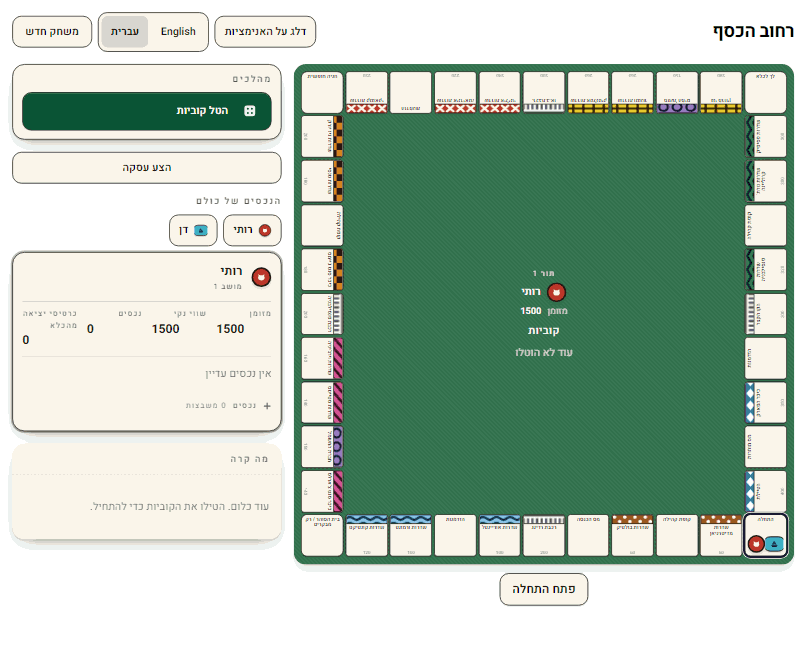

<div dir="rtl">

# רחוב הכסף · Kesef Street

[English](README.md) · **עברית**

משחק לוח דו־לשוני של קנייה ומכירה של נכסים, ל־2–6 שחקנים, לפי הכללים הקלאסיים המוכרים.
אדם מול אדם, אדם מול מחשב, או כל תערובת של שישה מושבים — הכול על מסך אחד, בעברית או
באנגלית, כשהעברית **משוקפת** מימין לשמאל ולא רק מתורגמת.



*הוקלט מהאפליקציה הרצה — אדם מול מחשב ברמה קלה, על לוח אטלנטיק סיטי.*

## מה אפשר לשחק כבר עכשיו

- **שתי שפות, שני לוחות, ובחירה נפרדת בכל אחד.** עברית או אנגלית; לוח אטלנטיק סיטי או לוח
  הערים הישראלי. לשני הלוחות אותה כלכלה בדיוק, משבצת מול משבצת, ובדיקה אוטומטית שומרת על כך
  — ולכן אותה מערכת כללים נכונה לשניהם, וכל לוח אפשר לשחק בכל שפה.
- **העברית משוקפת, לא מתורגמת.** הלוח, הפאנלים, מגש הקוביות וסדר הקריאה — כולם מתהפכים.
- **2–6 מושבים, כל אחד מהם יכול להיות מחשב.** בוחרים לכל מושב בנפרד בעת סידור השולחן.
  מהלכי המחשב מגיעים בזרימה בזמן שהם קורים, כך שאף אחד לא מחכה לתור שאינו שלו.
- **מצב ילדים.** מימוש אחד של הכללים שבו תכונות מכובות, ולא משחק שני ומפושט: בלי מכירות
  פומביות, בלי משכנתאות, החלפות מפושטות, קופה פותחת גדולה יותר, רמזים דלוקים ומשך משחק
  מוגדר. ילד ומבוגר מעולם אינם משחקים בשני משחקים שונים.
- **כל דמי שכירות אפשר להסביר, לא רק לגבות.** לכל סכום מוצמדת הסיבה שבגללה הוא יצא כזה —
  התעריף המודפס, מדרגת הבתים, המלון, או הכפלת הקבוצה השלמה — כך שלשאלה "למה אני חייב את
  זה" יש תשובה על המסך.
- **נבנה לבני שש ולמבוגרים עם עיוורון צבעים באותה נשימה**, כי שני הצרכים האלה נפגשים יותר
  משהם מתנגשים: לקבוצות צבע יש תמיד גם דוגמה או אייקון ולא רק צבע, לכל פעולה יש אייקון *וגם*
  מילים, קוביות וכספים מוקראים לקורא מסך, מיקוד המקלדת נראה לעין, שטחי הלחיצה הם 44 × 44
  פיקסלים לפחות, ושום דבר לא נחסם בגלל אנימציה.

עוד בעבודה: המחשב ברמה קשה, תור האנימציות, מגש ההשוואה זה־לצד־זה, שמירה וטעינה, וצופה
השחזור. [`docs/BACKLOG.md`](docs/BACKLOG.md) הוא הרשימה הכי כנה.

## למה המאגר הזה מעניין

זה משחק קטן, שנבנה בכוונה כמו שמערכת גדולה צריכה להיבנות.

**שלוש חבילות, ואחת מהן מחזיקה בכל הכללים.**

<div dir="ltr">

```
packages/engine   kesef-engine        apply(state, command) -> (state, events)
                                      pure Python, one dependency, no I/O, deterministic
packages/server   kesef-server        FastAPI + WebSocket. Sessions and serialization only.
packages/web      @kesef-street/web   React 19 + Vite + TypeScript + Tailwind. Presentation only.
```

</div>

**ארבעה כללים מחזיקים את הצורה הזאת במקומה.** הם אינם העדפות סגנון; כל אחד מהם סוגר משפחה
שלמה של תקלות.

1. **הכללים חיים במנוע, ורק במנוע.** שורת `if player.cash < rent` בשרת או בממשק היא תקלה,
   גם אם היא עובדת.
2. **המנוע מחזיר מפתחות תרגום, לא טקסט לאדם.** `tile.classic.boardwalk`,
   `error.not_your_turn`, `rent.note.full_group_doubled`. זה מה שהופך את הגרסה העברית לקטלוג
   ולא לשינוי קוד: אנגלית לא יכולה לחלוף מהכללים אל המסך, כי אין בהם אנגלית בכלל.
3. **המנוע טהור ודטרמיניסטי.** בלי שעון, בלי משתנים גלובליים, בלי קלט/פלט, בלי שינוי במקום.
   האקראיות באה מ־`state.rng`, שהוא חלק מהמצב המסודרי. חמש תכונות נופלות מכך מעצמן ולא נבנו:
   שמירה וטעינה, שחזור, ביטול מהלך, חיפוש קדימה של המחשב, ופרוטוקול תקשורת אם יגיע פעם משחק
   ברשת.
4. **הממשק אינו מכיר את הכללים — הוא מצייר את `legal_commands` ככפתורים.** המנוע מחזיר כל
   מהלך חוקי עם הפרמטרים שלו מלאים מראש, ולכן משפחת התקלות שבה הכפתור דלוק אבל המהלך נדחה
   פשוט אינה יכולה לקרות, ולמחשב מוצע בדיוק מה שמוצע לאדם.

לחבילת הווב יש כלל חמישי: **תכונות CSS לוגיות בלבד** (`ms-*`/`me-*`/`ps-*`/`pe-*`), כי
`ml-*` או `left` פיזיים הם תקלה שאינה נראית באנגלית וזועקת בעברית.

## התחלה מהירה

צריך [uv](https://docs.astral.sh/uv/) ו־Node 22. את Python 3.13 מתקין uv בעצמו.

<div dir="ltr">

```bash
uv sync                                          # toolchain + both Python packages
uv run uvicorn kesef_server.api:app --reload     # API and docs on :8000
```

</div>

ואז, במסוף שני:

<div dir="ltr">

```bash
cd packages/web
npm ci
npm run dev                                      # the game on :5173
```

</div>

פותחים את <http://localhost:5173>. המשחק נפתח בעברית; כפתורי השפה נמצאים במסך הפתיחה וגם
בסרגל העליון של המשחק. Vite מעביר את `/api` אל פורט 8000, ולכן בפיתוח הממשק והשרת הם באותו
מקור בדיוק כמו בייצור, ואין מסלול קוד שרק הפיתוח מפעיל.

מעדיפים בלי דפדפן בכלל? את המנוע אפשר להריץ מהמסוף:

<div dir="ltr">

```bash
uv run kesef boards          # the bundled boards
uv run kesef show classic    # a full layout, with economics
```

</div>

## השער

כל מה שלמטה ירוק לפני שמשהו מתמזג. **`ruff check` שעובר אינו `ruff format --check` שעובר** —
אלה שני שערים נפרדים, ושניהם רצים.

<div dir="ltr">

```bash
uv run ruff check .
uv run ruff format --check .
uv run mypy
uv run pytest
```

```bash
cd packages/web
npm run typecheck
npm run lint
npm run format:check
npm run test -- --run
npm run build
npm run test:e2e          # Playwright; boots uvicorn and Vite itself
```

</div>

ה־CI מריץ את אותה הרשימה, ובנוסף `pip-audit`, רצפת כיסוי לשרת, ובדיקת סחיפה בחוזה ה־API.
ב־[`CONTRIBUTING.md`](CONTRIBUTING.md) יש את הפרטים, כולל אילו בדיקות חייב כל כלל חדש.

## מבנה

<div dir="ltr">

```
packages/engine/   kesef-engine — the rules. Pure Python, no I/O, deterministic.
packages/server/   kesef-server — FastAPI + WebSocket. Thin. Owns no rules.
packages/web/      React 19 + Vite + TypeScript + Tailwind. Owns no rules either.
docs/              design spec, ADRs, backlog, and the orchestration brief
docs/media/        the gameplay clips in these READMEs
```

</div>

## מסמכים

| מסמך | למה הוא נועד |
|---|---|
| [`docs/superpowers/specs/2026-07-25-kesef-street-design.md`](docs/superpowers/specs/2026-07-25-kesef-street-design.md) | מסמך העיצוב — קוראים אותו ראשון |
| [`docs/PROJECT_BRIEF.md`](docs/PROJECT_BRIEF.md) | מה הוחלט, ומה נדחה |
| [`docs/BACKLOG.md`](docs/BACKLOG.md) | כל פריט עבודה, עם קריטריוני קבלה |
| [`docs/adr/`](docs/adr/) | ההחלטות, עם החלופות |
| [`CONTRIBUTING.md`](CONTRIBUTING.md) | התקנה, השער, זרימת ה־PR, ומה חייב כלל חדש |
| [`CLAUDE.md`](CLAUDE.md) | מוסכמות ומעקות בטיחות לסוכנים שעובדים כאן |

### הקלטה מחדש של הסרטונים

ה־GIF־ים שבשני קובצי ה־README הם משחק אמיתי, לא הדמיה, ואפשר לשחזר אותם. מפעילים את השרת
ואת הווב כמו בהתחלה המהירה, ואז מנווטים עם Playwright דרך מסך הפתיחה האמיתי אל משחק של שני
מושבים (אדם מול מחשב ברמה קלה), ומצלמים את הדף כל 800 מילישניות, כשלושים פריימים, בחלון
1120 × 900. בוחרים פעולות לפי `data-command-kind` ולא לפי הכתובת שעליהן, כדי שסקריפט אחד
יריץ את שתי השפות.

שני דברים כדאי לדעת לפני שמנסים. **ממתינים עד שהיומן מפסיק לגדול בין פקודה לפקודה** — השרת
מתזמן את קידום המחשב כמשימת רקע לכל פקודה, ולכן שליחת הפקודה הבאה מוקדם מדי מריצה שתיים כאלה
במקביל ומהלכי המחשב מופיעים פעמיים. ו**מקודדים עם שקיפות בין פריימים**: כמעט כל פיקסל במשחק
לוח זהה לפיקסל שלפניו, ולכן שמירה של מה שזז בלבד לוקחת את אותם שלושים ושניים פריימים
מ־1.7 מגה־בייט לפחות מ־260 קילו־בייט, וזה מה ששומר אותם מתחת לתקרת 500 הקילו־בייט של
בדיקת ה־pre-commit.

## רישיון וסימני מסחר

MIT — ראו [`LICENSE`](LICENSE).

זהו מימוש עצמאי ומקורי של הכללים הנפוצים של משחק לוח לקנייה ומכירה של נכסים. הוא **אינו**
מסונף לאף בעל זכויות בתחום, אינו מאושר על ידו ואינו נגזר מנכסיו, ובכוונה הוא נושא שם משלו,
עיצוב משלו ושמות לוח משלו. שמות הרחובות בלוח `classic` הם שמות מקומות אמיתיים באטלנטיק
סיטי, ניו ג'רזי.

</div>
