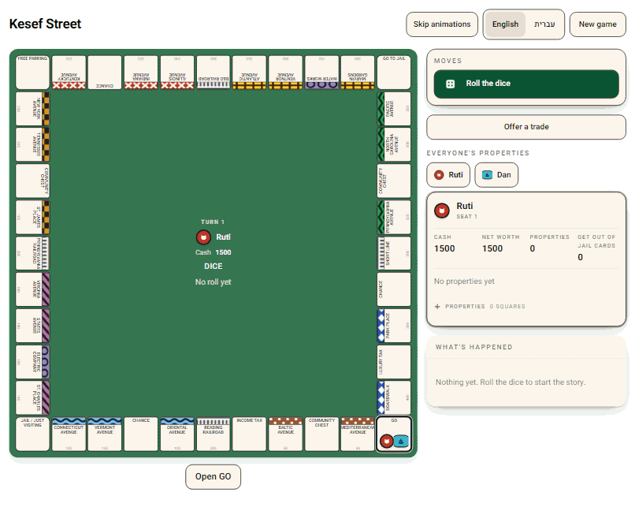

# Kesef Street · רחוב הכסף

**English** · [עברית](README.he.md)

A bilingual property-trading board game for 2–6 players, playing the classic universal rules.
Person against person, person against computer, or any mix across six seats — all on one
screen, in English or in Hebrew, mirrored right-to-left rather than merely translated.



*Recorded from the running app — a person against an easy bot on the Atlantic City board.*

## What you can play today

- **Two languages, two boards, chosen separately.** English or Hebrew; the Atlantic City board
  or the Israeli city board. The boards share identical economics square for square, enforced
  by a test, so one ruleset stays correct for both — and either board can be played in either
  language.
- **Hebrew is mirrored, not translated.** The board, the panels, the dice tray and the reading
  order all flip. The [Hebrew README](README.he.md) shows what that looks like.
- **2–6 seats, any of them a computer.** Chosen per seat as you set the table. Bot moves stream
  in as they happen, so nobody waits on a turn they are not taking.
- **Kids Mode.** One ruleset implementation with features switched off rather than a second,
  simplified game: no auctions, no mortgages, simplified trades, a larger opening bank, hints
  on and a target duration. A child and an adult are never playing two different games.
- **Every rent can be explained, not just charged.** Each figure carries the reason it came
  out that way — the printed rate, the house tier, the hotel, or the whole-group doubling — so
  "why do I owe that" has an answer on screen.
- **Built for six-year-olds and colourblind adults at once**, because those two needs overlap
  more than they conflict: colour groups always carry a pattern or an icon as well as a colour,
  every action is an icon *and* words, dice and money are narrated to a screen reader, focus is
  visible, hit targets are at least 44 × 44 px, and nothing ever blocks on an animation.

Still in flight: the hard bot, the animation queue, the side-by-side compare tray, save/load
and the replay viewer. [`docs/BACKLOG.md`](docs/BACKLOG.md) is the honest list.

## Why this repo might interest you

It is a small game, deliberately built the way a large system should be.

**Three packages, and one of them owns every rule.**

```
packages/engine   kesef-engine        apply(state, command) -> (state, events)
                                      pure Python, one dependency, no I/O, deterministic
packages/server   kesef-server        FastAPI + WebSocket. Sessions and serialization only.
packages/web      @kesef-street/web   React 19 + Vite + TypeScript + Tailwind. Presentation only.
```

**Four rules hold that shape in place.** They are not style preferences; each one closes off a
family of bugs.

1. **Rules live in the engine, and only in the engine.** An `if player.cash < rent` in the
   server or the UI is a defect whether or not it happens to work.
2. **The engine returns i18n keys, never prose.** `tile.classic.boardwalk`,
   `error.not_your_turn`, `rent.note.full_group_doubled`. This is what makes the Hebrew build a
   catalogue rather than a code change: English cannot leak out of the rules, because there is
   none in them.
3. **The engine is pure and deterministic.** No clock, no globals, no I/O, no mutation.
   Randomness comes from `state.rng`, which is part of the serialized state. Five features fall
   out of that rather than being built: save/load, replay, undo, bot lookahead, and a wire
   protocol if networked play ever arrives.
4. **The UI knows no rules — it renders `legal_commands` as buttons.** The engine returns every
   legal move with its parameters already filled in, so the bug family where the button is
   enabled but the move is rejected cannot occur, and a bot is offered exactly what a person is.

The web package carries a fifth: **logical CSS properties only** (`ms-*`/`me-*`/`ps-*`/`pe-*`),
because a physical `ml-*` or `left` is a bug that is invisible in English and obvious in Hebrew.

## Quick start

You need [uv](https://docs.astral.sh/uv/) and Node 22. Python 3.13 is installed by uv itself.

```bash
uv sync                                          # toolchain + both Python packages
uv run uvicorn kesef_server.api:app --reload     # API and docs on :8000
```

Then, in a second terminal:

```bash
cd packages/web
npm ci
npm run dev                                      # the game on :5173
```

Open <http://localhost:5173>. It opens in Hebrew; the language buttons are on the setup screen
and in the game chrome. Vite proxies `/api` to :8000, so the front end is same-origin in
development exactly as it is in production, and no CORS-only code path exists that production
never exercises.

Prefer no browser at all? The engine is drivable from the terminal:

```bash
uv run kesef boards          # the bundled boards
uv run kesef show classic    # a full layout, with economics
```

## The gate

Everything below is green before anything merges. **A passing `ruff check` is not a passing
`ruff format --check`** — they are separate gates and both run.

```bash
uv run ruff check .
uv run ruff format --check .
uv run mypy
uv run pytest
```

```bash
cd packages/web
npm run typecheck
npm run lint
npm run format:check
npm run test -- --run
npm run build
npm run test:e2e          # Playwright; boots uvicorn and Vite itself
```

CI runs the same set plus `pip-audit`, a server-coverage floor and an API-contract drift check.
[`CONTRIBUTING.md`](CONTRIBUTING.md) has the details, including what tests a new rule owes.

## Layout

```
packages/engine/   kesef-engine — the rules. Pure Python, no I/O, deterministic.
packages/server/   kesef-server — FastAPI + WebSocket. Thin. Owns no rules.
packages/web/      React 19 + Vite + TypeScript + Tailwind. Owns no rules either.
docs/              design spec, ADRs, backlog, and the orchestration brief
docs/media/        the gameplay clips in these READMEs
```

## Documentation

| Document | What it is for |
|---|---|
| [`docs/superpowers/specs/2026-07-25-kesef-street-design.md`](docs/superpowers/specs/2026-07-25-kesef-street-design.md) | the design spec — read this first |
| [`docs/PROJECT_BRIEF.md`](docs/PROJECT_BRIEF.md) | what we decided, and what we rejected |
| [`docs/BACKLOG.md`](docs/BACKLOG.md) | every work item, with acceptance criteria |
| [`docs/adr/`](docs/adr/) | the decisions, with the alternatives |
| [`CONTRIBUTING.md`](CONTRIBUTING.md) | setup, the gate, the PR flow, what a rule owes |
| [`CLAUDE.md`](CLAUDE.md) | conventions and guardrails for agents working here |

### Re-recording the clips

The GIFs in these READMEs are real gameplay, not a mock-up, and they are reproducible. Start the
API and the web app as in the quick start, then drive the real setup screen with Playwright into
a two-seat game (a person against an easy bot), screenshotting the page every 800 ms for about
thirty frames at a 1120 × 900 viewport. Select actions by `data-command-kind` rather than by
label, so one script drives both languages.

Two things are worth knowing before you try. **Wait for the log to stop growing between
commands** — the server queues bot advancement as a background task per command, so posting the
next command too early runs two of them at once and the bot's moves appear twice. And **encode
with inter-frame transparency**: almost every pixel of a board game is identical to the pixel
before it, so storing only what moved takes the same thirty-two frames from 1.7 MB to under
260 KB, which is what keeps them inside the 500 KB pre-commit ceiling.

## Licence and trademarks

MIT — see [`LICENSE`](LICENSE).

This is an independent, original implementation of the widely played rules of a
property-trading board game. It is **not** affiliated with, endorsed by, or derived from the
assets of any rights holder in that genre, and it deliberately carries its own name, its own
artwork and its own board naming. The Atlantic City street names on the `classic` board are real
place names in Atlantic City, New Jersey.
